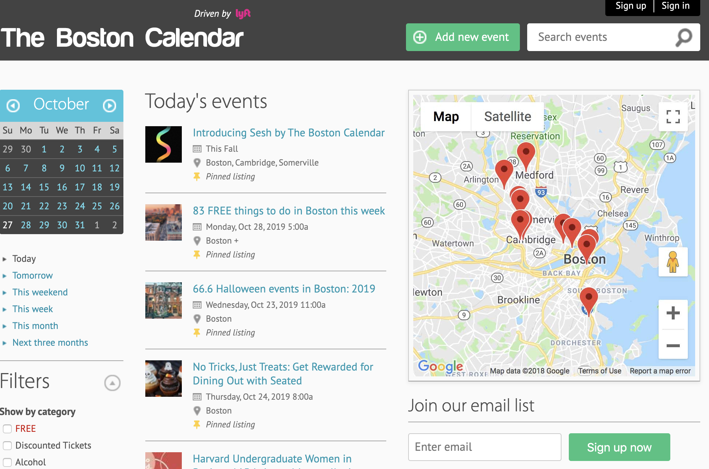
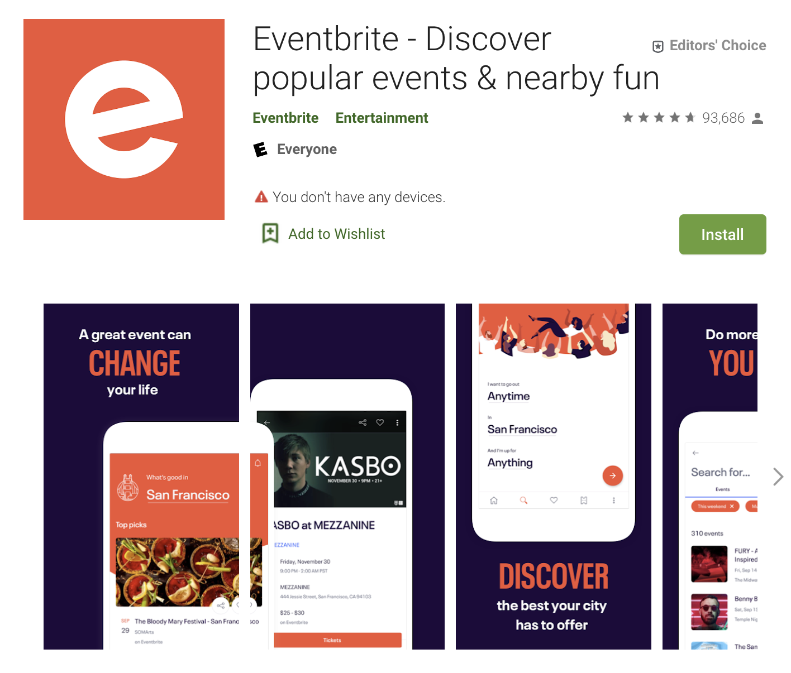
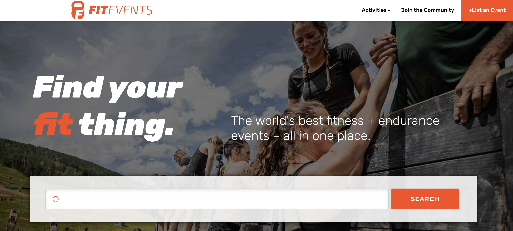

# Fitness Event APP

## Product Mission
This App is majorly specific for the users who is wiling to exercise. It help users search for the nearby fitness events by locating users position. Provide different events about fitness to meet the various need of the public. Also, for those who are interested in the same field, they can share their information and organize a new event by themselves.

## Target Users
* Athelete
* Person who pursue losing weights
* Person who want to keep fit

## User Story
* I, as an athlete, I would like to go to a place where hold a seminar about nutrition intake for the professional.

* I, as an athlete, I would like to participate in an event where I can meet with other professionals in the same fields. We can work together on training and exchange our experience. 

* I, as a soccer player, I would like to go to watch the soccer game/training match and share experience with those soccer enthusiasts.

* I, as a person who goes to gymnasium twice a week, I would like to know interesting surrounding fitness events, and take part in some activities I am interested in to spice my normal gym day up.

* I, as a person who usually goes to gymnasium alone, I would like to participate in some fitness events to learn new things and meet new friends.

* I, as a person who just starts working out at the gym, I would like to take part in various fitness events to find out what I really interested in.

* I, as a naive fitness keeper, want to find a lot of classes to find a sport which I can stick on.

* I, as a member of family who want to keep fit, want to find more and more free courses hold by fitness centers or clubs via this app.

* I, as an outdoor fitness enthusiast, want to join outdoor sport events like marathon, cycling.

* I, as a bodybuilder, want to join bootcamps to communicate and exchange experiences on building bodies.

## Architecture

## MVP
* Background survey, Access to "join/create" an event.
* Feedback(provide number of potential customers based on their activities to the event creator) and Notification.
* Estimate the calorie consumption for each event.
* User Interface
* Utilize Google Map API
* Social module for user-defined groups

## Product Survey
#### [The Boston Calendar](https://www.thebostoncalendar.com/)

Majorly focus on finding under-publicized events around the city and surrounding areas for Bostonians (and non-locals).
* <strong> Pros </strong>
  * Provide mostly-free events around Boston for reddit user, young professional, and student.
  * Redditors can add events, and events can be add to Reddit, iCal, and Google Calendar on the website.
* <strong> Cons </strong>
  * Do not have mobile application.
  * The webpage design is quite simple.
  * The webpage don't have a specific category for fitness.

#### [EventBrite](https://www.eventbrite.com/d/ma--boston/events/)

Majorly focus on providing many kinds of events in a lot of places and creating events to the public.
* <strong> Pros </strong>
  * Collect a rich set of events.
  * Users are able to buy events tickets on it.
  * Using Google Map to show events location.
* <strong> Cons </strong>
  * For fitness domain, it cannot provide exhaustive classcifications.
  * For creating an event, it cannot push to the specific group.

#### [FitEvents](https://fitevents.com/): 

Majorly focus on providing professtional training classes and formal events to users. 
* <strong> Pros </strong>
  * Users can submit their own event to the community to list, sell tickets and promote.
  * Users can subscribe to the fitevents categories they are interested in.
* <strong> Cons </strong>
  * Do not have mobile application.
  * Most they presents are global events, holding in a location which is far away from most people. For most people, they prefer choosing a event around their houses. 

## Technology Used
#### API
* Google Map API: A helpful open source location map platform for us to fetch the location data.
* eventbrite API: Allow us to select and collect the fitness events data.

#### Language
* Java: The java language is an object-oriented language and it is useful for App development on Android Studio.
* JSON: It has great advantages in executing the data in database.

#### Database
* Firebase: The core of Firebase is the real-time database. It doesn't have the restriction format, for example, SQL using tables to store data. User can use Firebase to store what they want without that kind of restriction. The Firebase also very friendy to Android (both of them are from Google). Besides, to build a connection with our database and Google map API, if we choose SQL, we also need to hava a intermediate knowledge about SQL, PHP and XML. But if we use Firebase, then just need to learn about the Firebase platform. 

#### App
* Android Studio(eg.Viewmodel:automatically retained during configuration changes)

## Sprint2 slide
https://docs.google.com/presentation/d/1l6T0y_Ir_2tTSCEw53Uxm2SvkL_4gfNNL3P8KNi42RY/edit?usp=sharing

## Sprint3 
* Achieve the function that display events from eventbriteapi in CardView format and relative detailed activity.
* Use firestore as database to write and read events.

